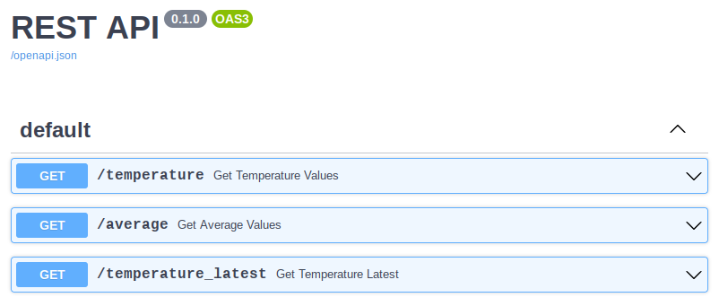
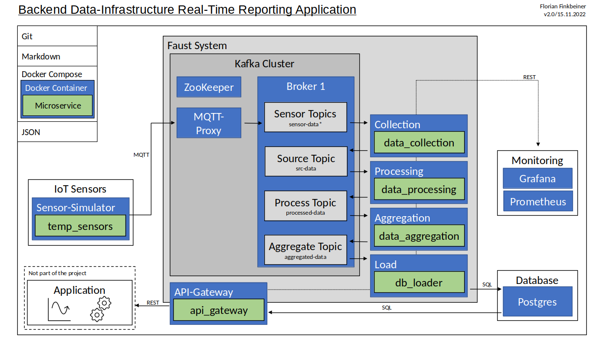

# backend-infrastructure-demo

Demo project of a backend infrastructure in python with kafka and faust for data-intensive real-time applications.

# Table of Contents
- [Prerequisites](#prerequisites)
- [Launch](#launch)
- [External Interfaces](#external-interfaces)
- [Project Description](#project-description)
- [Project Structure](#project-structure)
- [Used Sources](#used-sources)
- [Restrictions](#restrictions)
- [Parallel Batch Processing Pipeline](#parallel-batch-processing-pipeline)
- [Bibliography](#bibliography)

# Prerequisites

[Docker Desktop](https://docs.docker.com/desktop/) (tested with version 4.12.0) must be installed, or at least
- Docker (tested with version 20.10.20)
- Docker Compose (tested with version 2.10.2)

# Launch

To get the infrastructure running on a local machine, only the following steps are required:
1. Clone the repository
    ```
    git clone https://github.com/finkbefl/backend-infrastructure-demo.git
    ```
2. Launching the Docker infrastructure using the Docker Compose file
   ```
   docker compose -f "docker-compose.yaml" up -d --build
   ```

# External Interfaces

- Grafana: `localhost:3000`  
  Initial login: user = admin, password = admin  
  The dashboard visualize
  - the number of data values received, processed and sent per min for the data_collection, data_processing and data_aggregation microservices
  - the number of values loaded into the database per min
  - the latency of the data values from the data simulation to the loading into the database
  - the number of REST API requests and the age of the requested last values
- Consumer API (Swagger UI): `localhost:8007/docs`  
  There are three HTTP GET methods implemented:
  - `/temperature`: Get all temperature values from the database for a specific sensor number between two timestamps
  - `/average`: Get all average values from the database for a specific sensor number between two timestamps
  - `/temperature_latest`: Get the latest available temperature value from the database for a specific sensor number
  

# Project Description

To build a flexible, scalable and fault-tolerant environment with low latency, the modern stream processing system Kafka will be used. The infrastructure is implemented with only one broker. Depending on the load on the productive system, distribution and replication can be implemented at any time using multiple brokers to increase the scalability and availability of the system.

The functionality of the backend is divided into small, isolated, event-driven microservices, which communicate asynchronously with Kafka through lean APIs. These microservices, encapsulated in individual Docker containers, are implemented using Python and can be integrated into the Kafka environment using the Faust library. The resulting increased security and ease of maintenance lead to a more complex deployment, which is why Docker Compose will be used. The microservices have the following roles:
- data_collection: Collect all raw sensor-data
- data_processing: Converting all sensor values to a common data type
- data_aggregation: Aggregate the data of the specific sensor number by calculating the average over the last 10 values
- db_loader: Load processed and aggregated data to the database

Test data in the form of temperature sensors can be simulated via a corresponding microservice and streamed into the system via the IoT-compliant MQTT protocol using a proxy. Separate topics correspond to the individual processing steps of the data and are to be monitored using Grafana and Prometheus.

The data from a Postgres database are provided to consumers through a REST API via an API gateway.


Source: Own illustration based on Alaasam et al., 2019, Fig. 1

# Project Structure

`$ tree --dirsfirst`  
`.`  
`├── aggregation`: Module which implements data-aggregation   
`│   ├── data_aggregation`: Microservice implementations   
`│   │   ├── main.py`: Aggregation of the processed data in python  
`│   │   └── requirements.txt`: Microservice requirements installed within the container  
`│   └── Dockerfile`: Docker image definition  
`├── api-gateway`: Module which implements the API gateway  
`│   ├── api_gateway`: Microservice implementations    
`│   │   ├── database.py`: Postgres database interface  
`│   │   ├── data_definition.py`: Definitions of the database table structures  
`│   │   ├── main.py`: Consumer REST-API via python FastAPI  
`│   │   └── requirements.txt`: Microservice requirements installed within the container   
`│   └── Dockerfile`: Docker image definition  
`├── collection`: Module which implements data-collection  
`│   ├── data_collection`: Microservice implementations    
`│   │   ├── main.py`: Collection of the raw sensor data in python  
`│   │   └── requirements.txt`: Microservice requirements installed within the container  
`│   └── Dockerfile`: Docker image definition  
`├── config`: Central configuration  
`│   ├── grafana`: Grafana config  
`│   │   ├── dashboards`: Dashboard definitions  
`│   │   │   └── services_dashboard.json`: The microservice dashboard  
`│   │   └── provisioning`: Grafana provision  
`│   │       ├── dashboards`: Dashboard provisioning  
`│   │       │   └── default.yaml`: Provision the dashboard  
`│   │       └── datasources`: Datasource provisioning  
`│   │           └── datasource.yaml`: Provision the datasources  
`│   ├── mqtt-broker`: MQTT broker config (temporarily used for testing)  
`│   │   └── mosquitto.conf`: Mosquitto MQTT broker config  
`│   └── prometheus`: Prometheus config  
`│       └── prometheus.yaml`: Configuration of prometheus  
`├── docs`: Files for documentation  
`│   └── assets`: Assets for documentation  
`│       └── images`: Images for documentation  
`│           ├── Consumer_API.png`: Screenshot of the consumer API swagger UI  
`│           └── Data_Infrastructure.png`: Architecture overview  
`├── load`: Module which implements data-loading into the database   
`│   ├── db_loader`: Microservice implementations    
`│   │   ├── database.py`: Postgres database interface  
`│   │   ├── data_definition.py`: Definitions of the database table structures  
`│   │   ├── main.py`: Loading of the processed and aggregated data into the database in python   
`│   │   └── requirements.txt`: Microservice requirements installed within the container  
`│   └── Dockerfile`: Docker image definition  
`├── processing`: Module which implements data-processing   
`│   ├── data_processing`: Microservice implementations    
`│   │   ├── main.py`: Processing of the collected data in python  
`│   │   └── requirements.txt`: Microservice requirements installed within the container  
`│   └── Dockerfile`: Docker image definition  
`├── sensor-simulator`: Module which implements the sensor simulation  
`│   ├── mqtt_proof_of_concept_scripts`: Python scripts used for first PoC using paho mqtt python client  
`│   │   ├── publish.py`: Python script to test mqtt publishing  
`│   │   └── subscribe.py`: Python script to test mqtt subscribing  
`│   ├── temp_sensors`: Microservice implementations    
`│   │   ├── main.py`: Publish random temperature values between a range in python  
`│   │   └── requirements.txt`: Microservice requirements installed within the container  
`│   └── Dockerfile`: Docker image definition  
`├── docker-compose.yaml`: Docker Compose file to launch the docker infrastructure  
`├── .env`: Docker Compose environment variables  
`├── LICENSE`: License file  
`└── README.md`: This README file  

# Used Sources

- Project is based on ideas from [microservice_in_python](https://github.com/KrasnovVitaliy/microservice_in_python) GitHub repository from [KrasnovVitaliy](https://github.com/KrasnovVitaliy)
- Sensor simulator is based on [Temperature-Sensor-Simulator](https://github.com/PrakashGudditi/Temperature-Sensor-Simulator/blob/master/cli2.py) GitHub repository from [PrakashGudditi](https://github.com/PrakashGudditi)

# Restrictions

- Demo project can be executed on a local machine. The deployment to a cloud is currently not considered.
- confluentinc/cp-kafka: Community licensed ([Docker Image Reference](https://docs.confluent.io/platform/current/installation/docker/image-reference.html))
- confluentinc/cp-kafka-mqtt: Commercially licensed ([Docker Image Reference](https://docs.confluent.io/platform/current/installation/docker/image-reference.html))
- Latency and age measurements depend on synchronisation of the different container-system-times (not an issue on a local machine)
- Focus of the project is on the data infrastructure, less on the full implementation of 
  - the individual microservices (error handling, unit tests)
  - detailed security configurations (encrypted communication)
  - full-featured consumer interface
  - replication (multiple brokers)
- Performance of the system still has potential for improvement
- Currently, two sensors are simulated by the sensor simulator, each of which publish a value via MQTT every second, one sensor as integer and the other as float values

# Parallel Batch Processing Pipeline

Batch processing is still used in many existing systems.
The question is how the infrastructure can be extended so that batch processing of data is possible in parallel. The answer here could also be Apache Kafka to continue to take full advantage of data streaming and combine it with batch processing, e.g. for existing batch data sources. See the following blog post for more details: [How to implement Batch Processing with Apache Kafka](https://www.kadeck.com/blog/how-to-implement-batch-processing-with-apache-kafka)

One solution could be to add more brokers in parallel to the stream infrastructure and link them to suitable microservices which take over the batch processing. The processed and aggregated data from both pipelines can thus also be easily made available via a consumer interface.

Using Kafka for batch processing has advantages and disadvantages compared to traditional batch processing systems. For processing large amounts of data, however, Kafka's scaling capabilities are definitely a decisive criteria, especially if a streaming pipeline via Kafka is required in parallel anyway. See the following blog post for more details: [ETL Batch Processing With Kafka?](https://medium.com/swlh/etl-batch-processing-with-kafka-7f66f843e20d)

# Bibliography

> Alaasam, A. B. A., Radchenko, G., & Tchernykh, A. (2019). Stateful Stream Processing for Digital Twins: Microservice-Based Kafka Stream DSL. 2019 International Multi-Conference on Engineering, Computer and Information Sciences (SIBIRCON), 0804–0809. https://doi.org/10.1109/SIBIRCON48586.2019.8958367


